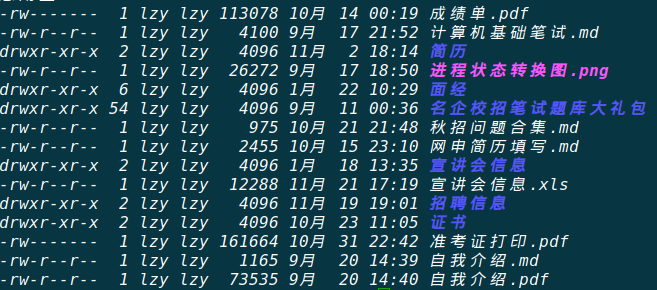
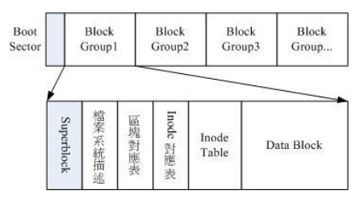
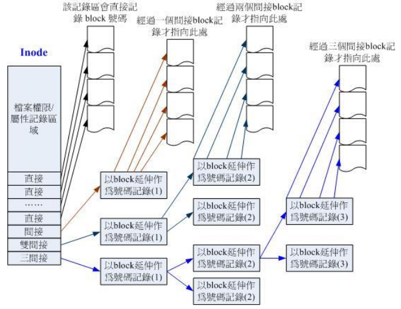
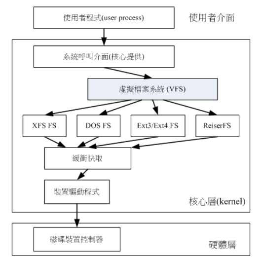
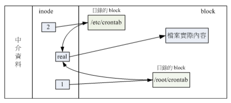
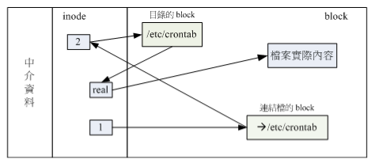

# Linux 学习笔记

## 一、Linux如何学习

### 1. Linux的用途

 - 企业环境的利用
    - 网络服务器
    - 关键任务的应用
    - 学术机构的高性能运算任务
    - 计算机集群
- 个人环境的利用
  - 桌面计算机
  - 手持系统
  - 嵌入式系统


### 2. Linux distributions 和 Linux Kernel

- Linux Distributions 是linux发行版，有Ubuntu、FreeBSD等，针对个人桌面计算机所开发的
- Linux Kernel 是Linux系统的内核，不同的发行版有可能使用相同的内核


## 二、主机规划与磁盘分区

### 1. Linux中的硬件设备

- Linux中每个硬件设备都被当成一个文件来对待，以下是不同设备对应的文件名

  | 设备                  | 设备在Linux内的文件名                            |
  | ------------------- | ---------------------------------------- |
  | **IDE硬盘**           | /dev/hd[a-d]                             |
  | **SCSI/SATA/USB硬盘** | /dev/sd[a-p]                             |
  | U盘                  | /dev/sd[a-p]                             |
  | 软驱                  | /dev/fd[0-1]                             |
  | 打印机                 | 25针：/dev/lp[0-2] 、 USB：/dev/usb/lp[0-15] |
  | 鼠标                  | USB：/dev/usb/mouse[0-15]、PS2：/dev/psaux  |
  | 当前CD ROM/DVD ROM    | /dev/cdrom                               |
  | 当前鼠标                | /dev/mouse                               |
  | 磁带机                 | IDE：/dev/ht0、SCSI：/dev/st0               |


### 2. 磁盘分区

- 磁盘的连接方式决定了该设备在Linux中的文件名

  1. 主机中有两个IDE接口IDE1和IDE2,而一条IDE电缆可以连接两个设备，分别为Master（主设备）和Slave（从设备），所以一台主机可以连接四个IDE设备，文件名分别如下：

     | IDE\Jumper | Master   | Slave    |
     | ---------- | -------- | -------- |
     | IDE1       | /dev/hda | /dev/hdb |
     | IDE2       | /dev/hdc | /dev/hdd |

  2. 而SATA/SCSI/USB接口的设备都使用SCSI模块i驱动，文件名都是/dev/sd[a-p]，而且文件名是按照Linux内核检测到磁盘的顺序从sda-sdp来命名的

- 磁盘的组成

  - 磁盘由盘片、机械手臂、磁头与主轴马达组成
  - 盘片可细分成扇区和柱面，每个扇区有**512bytes**
  - 磁盘的第一个扇区记录了两个重要的信息
    - 主引导分区（Master Boot Record MBR）：可以安装引导加载程序的地方有446bytes；
    - 分区表（partition table）：记录整块硬盘分区的状态，有64bytes。
  - 系统开机时会主动读取MBR的内容，获取程序安装位置和如何开机的信息，很重要。

- 磁盘分区表

  - 柱面是文件系统的最小单位，也是分区的最小单位；
  - 将分区表的64bytes分为四组记录区，每组记录区记录该区段的开始和结束柱面号码，分区的设备文件名在硬盘设备文件名后再加一个数字，根据分区所在的位置顺序来定；
  - 分区表的四个分区称为主或扩展分区，主分区和扩展分区最多有4个，扩展分区最多有一个；
  - 如果要记录更多的分区信息，可以使用扩展分区，扩展分区的目的是使用更多的磁盘空间来记录分区信息；
  - 由扩展分区持续切割出来的分区称为逻辑分区，**逻辑分区的设备文件名称号码从5开始** ，前四个号码保留给主分区和扩展分区；
  - 主分区和逻辑分区能够被格式化来作为数据访问的分区，扩展分区不能被格式化；
  - 逻辑分区的数量依操作系统的不同而不同。

- 主引导分区（MBR）

  - 系统开机的流程
    1. BIOS：开机时系统会主动执行的第一个程序（计算机固件，写入到硬件上的软件程序），会认识第一个可开机的设备。
    2. MBR：第一个可开机设备的第一个扇区内的主引导分区块，内含引导加载程序。
    3. 引导加载程序（Boot loader）：一支可读取内核文件来执行的软件。
    4. 内核文件：开始操作系统的功能。
  - Boot loader的功能
    - 提供菜单，选择不同的开机选项。
    - 载入内核文件，直接指向可开机的程序区段来开始操作系统
    - 转交其他的loader，将引导加载功能转交给其他的loader负责。
    - Boot loader除了可安装在MBR之外，还可以安装在每个分区的引导扇区（boot sector）
  - 多重引导
    - 每个分区都拥有自己的启动扇区；
    - 实际可开机的内核文件是放到各分区内的；
    - loader只会认识自己的系统分区内的可开机内核文件及其他loader；
    - loader可直接指向或者是间接将管理权转交给另一个管理程序。

- Linux目录树结构

  - Linux中所有数据都以文件的形式来呈现。目录树结构是以根目录为主，然后向下呈现分支状的目录结构的一种文件结构，最重要的是根目录，用斜线“/”表示；
  - 文件系统与目录树的关系
    - Linux中使用挂载来结合目录树的架构和磁盘内的数据。

    - **挂载就是利用一个目录当成进入点，将磁盘分区的数据放置在该目录下，也即进入该目录就可以读取该分区的数据**

      ​

      ​     


## 三、Linux基础命令

### 1. 基础命令操作

- 修改系统的语言
  - `echo $LANG` 可以显示当前系统使用的语言
  - `LANG=xxx` 可以设置当前系统的语言（本次登录有效）
- date：显示日期
- cal：显示日历

### 2. Linux系统在线求助man page 和 info page

- man 命令查询命令的详细用法

- 命令名称之后带的数字代表的意义如下：

  | 代号   | 代表内容                     |
  | ---- | ------------------------ |
  | 1    | 用户在shell环境中可以操作的命令或可执行文件 |
  | 2    | 系统内核可调用的函数与工具等           |
  | 3    | 一些常用的函数与函数库              |
  | 4    | 设备文件的说明，通常在/dev下的文件      |
  | 5    | 配置文件或者是某些文件的格式           |
  | 6    | 游戏                       |
  | 7    | 惯例与协议等，例如Linux文件系统、网络协议  |
  | 8    | 系统管理员可用的管理命令             |
  | 9    | 跟kernel有关的文件             |

- man page页面可以使用/string来向下查询string字符串，?string 用来向上查询string字符串

- -f 选项可以查询更多的相关的信息

- -k 选项可以根据关键字查询说明文件中含有该关键字的命令

- info page把命令放在一个个节点中

- /usr/share/doc目录中存放了软件的说明文档

### 3. 正确的关机方法

- 关机前：sync，将数据同步写入硬盘中
- 惯用的关机命令：shutdown（halt、poweroff）
- 重启：reboot
- 切换执行等级：init
  - Linux的执行等级有7中，其中四种如下：
    - run level 0：关机
    - run level 3：纯命令行模式
    - run level 5：含有图形界面的模式
    - run level 6：重启
  - 可以使用 init 命令来切换执行等级，如用`init 0` 可以关机

### 4. 忘记 root 密码

- 出现引导菜单那一页按e键
- 然后在Linux/kernel 那一行最后输入single 进入当用户维护模式，可以不输入密码直接获得root权限
- 然后使用passwd来修改密码

## 四、Linux文件权限与目录配置

### 1. 用户和用户组

- Linux文件的存取访问身份有三种，文件所有者owner、用户组group和其他人other
- 系统中的帐号与一般用户身份记录在/etc/passwd文件内，个人密码记录在/etc/shadow文件中，Linux所有的组名记录在/etc/group文件内

### 2. 文件权限

1. Linux文件属性

   

   - 第一列代表文件的类型和权限

     - 第一个字符代表文件的类型

       | 字符   | 代表的文件类型        |
       | ---- | -------------- |
       | d    | 目录             |
       | -    | 普通文件           |
       | l    | 链接             |
       | b    | 设备文件里可供存储的接口设备 |
       | c    | 设备文件里面的串行端口设备  |

     - 后面的字符三个为一组，每一组分别有可读（r）、可写（w）和可执行（x）三个权限，没有该权限用（-）表示

       - 第一组是文件所有者的权限
       - 第二组是同用户组的权限
       - 第三组是其他非本用户组的权限

   - 第二列代表有多少文件名链接到次节点

   - 第三列代表这个文件的所有者帐号

   - 第四列代表这个文件所属用户组

   - 第五列为这个文件的容量大小，默认单位为B

   - 第六列为这个文件的创建文件日期或者是最近的修改日期

   - 第七列为该文件名

2. 修改文件属性和权限

   - chgrp：改变文件或目录所属的用户组

     `chgrp [-R] new_group dirname/filename`

   - chown：改变文件所有者

     ```shell
     chown [-R] new_user dirname/filename
     chown [-R] new_user:group dirname/filename
     ```

   - chmod：改变文件权限，有两种方法

     1. 使用数字代表权限

        - 各个权限的分数对照如下：

          - r:4
          - w:2
          - x:1

        - 每种身份的权限的分数相加即为该身份的权限，如rwx为4+2+1=7；

          ```shell
          chmod [-R] xyz filename/dirname 
          xyz代表每个身份的权限数字，x是用户的权限数字，y是同用户组的权限数字，z是其他非本用户组的权限数字，是rwx的分数的累加
          ```

     2. 使用符号改变文件权限

        - 使用u、g、o、a四个字符来代表当前用户user、同组用户group、其他非同组用户others和所有用户all

        - 使用+（增加）、-（除去）、=（设置）三种符号来设置用户的权限

          ```shell
          chmod u=rwx,go=rx filename/dirname
          chmod a+x filename/dirname
          ```

3. 目录与文件权限的意义

   - 权限对文件的重要性
     - r（read）：可读取文件的实际内容
     - w（write）：可编辑、新增、修改文件的内容（但不能删除文件）
     - x（execute）：该文件具有可以被执行的权限
   - 权限对目录的重要性
     - r：读取目录结构列表的权限，可以查询目录下的文件名数据
     - w：在该目录下新建新的文件或目录，删除存在的文件或目录，文件重命名，移动文件或目录的位置
     - x：**目录的x权限代表用户能否进去该目录成为工作目录的用途**

4. 文件种类与扩展名

   - 文件种类
     - 普通文件：在文件种类和权限列中第一个字符为[-]，有纯文本文件、二进制文件和数据文件
     - 目录文件：第一个字符为[d]
     - 链接文件：第一个字符为[l]
     - 设备与设备文件
       - 块设备文件：存储数据，提供访问的设备，第一个字符为[b]
       - 字符设备文件：串行端口设备文件，第一个字符为[c]
     - 套接字：数据接口文件，用于网络数据连接，第一个字符为[s]
     - 管道：解决多个程序同时访问一个文件造成的错误文件，第一个属性为[p]
   - 文件扩展名
     - Linux文件你不能执行与x权限有关，与文件扩展名无关，文件名只是让用户了解该文件可能的用途
     - .sh：脚本或批处理文件
     - .tar、.tar.gz、.zip、.tgz压缩文件
     - .html、.php网页相关文件
   - 文件长度的限制
     - 单一文件或目录名最大容许长度为255个字符
     - 包含完整路径名称及目录的完整文件名为4096个字符

### 3. Linux目录配置

1. Linux目录配置标准：FHS

   - FHS标准目的在于规范不同的Linux发行版的每个目录下应该要放置什么样的数据。

   - FHS针对目录树架构仅定义出三层目录下面应该放置什么样的数据，分别是：

     - /（root，根目录）：与开机系统有关；
     - /usr（UNIX software resource）：与软件安装/执行有关；
     - /var（variable）：与系统的运行过程有关。

   - 根目录（/）的意义与内容

     - 根目录是系统最重要的目录，所有的目录都由根目录衍生出来，而且与开机、还原、系统修复等操作有关。

     - FHS建议根目录越小越好，不容易发生问题

     - 根目录下面应该有的子目录：

       | 目录     | 应放置文件内容                                  |
       | ------ | ---------------------------------------- |
       | /bin   | 放置当用户维护模式下还能够被操作的命令                      |
       | /boot  | 主要放置开机会使用到的文件，包括linux内核文件以及开机菜单与开机所需的配置文件 |
       | /dev   | 在linux系统中，任何设备与接口设备都以文件形式存在于这个目录中        |
       | /etc   | 系统主要的配置文件几乎都放置在这个目录内                     |
       | /home  | 系统默认的用户主文件夹                              |
       | /lib   | 放置开机时会用到的函数库，以及在/bin或/sbin下面的命令会调用的函数库   |
       | /media | 放置的是可删除的设备                               |
       | /mnt   | 用于**暂时**挂载某些额外的设备                        |
       | /opt   | 放置第三方软件的目录                               |
       | /root  | 系统管理员的主文件夹                               |
       | /sbin  | 放置开机过程所需要的，包括开机、修复还原系统所需要的命令             |
       | /srv   | srv可视为‘service’，放置某些网络服务的数据              |
       | /tmp   | 让一般用户或者是正在执行的程序暂时放置文件的地方                 |

     - 根目录下其他重要的目录

       | 目录          | 放置的文件                                   |
       | ----------- | --------------------------------------- |
       | /lost+found | 当文件系统发生错误时，将一些丢失的片段放置在这个目录下             |
       | /proc       | 虚拟文件系统，放置的数据都在内存中，不占用磁盘空间，如系统内核、进程的状态等  |
       | /sys        | 放置在内存中，记录与内核相关的信息，包括目前已加载的模块与内核检测到的硬件信息 |

     - 根目录与开机过程有关，开机过程仅有根目录所在的分区被挂载，其他与开机过程有关的目录必须放置在根目录下，包括：

       - /etc：配置文件
       - /bin：重要执行文件
       - /dev：所需要的设备文件
       - /lib：执行文件所需的函数库与内核所需的模块
       - /sbin：重要的系统执行文件

   - /usr目录的意义与内容

     - 系统默认的软件资源放置的目录

     - /usr建议有如下的子目录：

       | 目录            | 应放置的文件内容                            |
       | ------------- | ----------------------------------- |
       | /usr/bin/     | 绝大部分用户可使用的命令放置在这里                   |
       | /usr/include/ | C/C++等程序语言的头文件与包含文件的放置处。            |
       | /usr/lib/     | 包含各应用软件的函数库、目标文件，以及不被一般用户惯用的执行文件或脚本 |
       | /usr/local/   | 系统管理员在本机自行安装自己下载的软件，建议安装到此目录        |
       | /usr/sbin/    | 非系统正常运行所需要的命令                       |
       | /usr/share/   | 放置共享文件的地方                           |
       | /usr/src/     | 一般源码建议放到这里，src有source的意义            |

   - /var目录的意义与内容

     - /var目录主要针对常态性变动的文件，包括缓存（cache）、登录文件（logfile）

     - /var常见的子目录如下：

       | 目录          | 应放置文件内容                     |
       | ----------- | --------------------------- |
       | /var/cache/ | 应用程序本身运行过程中会产生的一些暂存文件       |
       | /var/lib/   | 程序执行过程中，需要使用的数据文件的放置目录      |
       | /var/lock/  | 给某些设备上锁，确保该设备一次只给单一软件程序使用。  |
       | /var/log/   | 登录文件放置的目录                   |
       | /var/mail/  | 放置个人电子邮件信件的目录               |
       | /var/run/   | 某些程序或者服务启动后，他们的pid会放置在这个目录下 |
       | /var/spool/ | 这个目录通常放置一些目录数据              |

2. 目录树

   - 目录树的起点为根目录；
   - 每一个目录不只能够使用本地端的文件系统，也可以使用网络上的文件系统
   - 每一个文件在此目录树中的文件名（包含完整路径）是独一无二的

3. 绝对路径和相对路径

   - 绝对路径：由根目录开始的文件名或目录名称；
   - 相对路径：相对于当前路径的文件名写法。


## 五、文件与目录管理

### 1. 目录与路径

1. 绝对路径与相对路径

   - 相对路径方便资源的查找，可能由于环境的变化而发生改变从而导致错误
   - 绝对路径的正确度比较好

2. 目录的操作

   - 几个特殊的目录

     ```shell
     .			代表此层目录
     ..			代表上一层目录
     -			代表前一个工作目录
     ～			代表目前用户身份所在的home目录
     ～account	代表account这个用户的home目录
     ```

     所有目录都有"."与".."目录，根目录下的".."目录与"."是同一个目录

   - 变换目录（change directory）命令：cd

     ```shell
     cd [相对路径或绝对路径]
     cd ～	回到自己的home目录
     cd 		也是回到自己的home目录
     cd -	回到上一次工作目录
     ```

   - 显示目前所在的目录（Print Working Directory）：pwd

     ```shell
     pwd [-P]
     -P	表示显示实际的路径，而不是链接文件
     ```

   - 建立新目录（make directory）：mkdir

     ```shell
     mkdir [-mp] 目录名词
     -m：配置文件的权限
     -p：将所需要的目录（包括上层目录）递归建立起来
     ```

   - 删除空目录（remove directory）：rmdir

     ```shell
     rmdir [-p] 目录名称
     -p：连同上层空的目录也一起删除
     ```

3. 关于执行文件路径的变量：$PATH

   - 当执行一个指令时，系统会根据PATH定义的目录去搜寻该指令的可执行文件，如果有多个该执行的可执行文件，则先找到的同名指令先执行
   - PATH由一系列目录构成，不同目录之间使用冒号(:)隔开
   - 不同身份的使用者的PATH不同

### 2. 文件与目录管理

1. 文件与目录的检视：ls

   ```shell
   # ls [-aAdfFhilnrRSt] 文件名或目录名称..
   # ls [--color={never,auto,always}] 文件名或目录名称..
   # ls [--full-time] 文件名或目录名称..
   选项与参数:
   -a :全部的文件,连同隐藏档( 开头为 . 的文件) 一起列出来(常用)
   -A :全部的文件,连同隐藏档,但不包括 . 与 .. 这两个目录
   -d :仅列出目录本身,而不是列出目录内的文件数据(常用)
   -f :直接列出结果,而不进行排序 (ls 预设会以档名排序!)
   -F :根据文件、目录等信息,给予附加数据结构,例如:
   *:代表可执行文件; /:代表目录; =:代表 socket 文件; |:代表 FIFO 文件;
   -h :将文件容量以人类较易读的方式(例如 GB, KB 等等)列出来;
   -i :列出 inode 号码,inode 的意义下一章将会介绍;
   -l :长数据串行出,包含文件的属性与权限等等数据;(常用)
   -n :列出 UID 与 GID 而非使用者与群组的名称 (UID 与 GID 会在账号管理提到!)
   -r :将排序结果反向输出,例如:原本档名由小到大,反向则为由大到小;
   -R :连同子目录内容一起列出来,等于该目录下的所有文件都会显示出来;
   -S :以文件容量大小排序,而不是用档名排序;
   -t :依时间排序,而不是用档名。
   --color=never
   :不要依据文件特性给予颜色显示;
   --color=always :显示颜色
   --color=auto :让系统自行依据设定来判断是否给予颜色
   --full-time :以完整时间模式 (包含年、月、日、时、分) 输出
   --time={atime,ctime} :输出 access 时间或改变权限属性时间 (ctime)
   而非内容变更时间 (modification time)
   ```

2. 复制：cp

   ```shell
   [root@study ~]# cp [-adfilprsu] 来源文件(source) 目标文件(destination)
   [root@study ~]# cp [options] source1 source2 source3 .... directory
   选项与参数:
   -a :相当于 -dr --preserve=all 的意思,至于 dr 请参考下列说明;(常用)
   -d :若来源文件为链接文件的属性(link file),则复制链接文件属性而非文件本身;
   -f :为强制(force)的意思,若目标文件已经存在且无法开启,则移除后再尝试一次;
   -i :若目标文件(destination)已经存在时,在覆盖时会先询问动作的进行(常用)
   -l :进行硬式连结(hard link)的连结档建立,而非复制文件本身;
   -p :连同文件的属性(权限、用户、时间)一起复制过去,而非使用默认属性(备份常用);
   -r :递归持续复制,用于目录的复制行为;(常用)
   -s :复制成为符号链接文件 (symbolic link),亦即『快捷方式』文件;
   -u :destination 比 source 旧才更新 destination,或 destination 不存在的情况下才复制。
   --preserve=all :除了 -p 的权限相关参数外,还加入 SELinux 的属性, links, xattr 等也复制了。
   最后需要注意的,如果来源档有两个以上,则最后一个目的文件一定要是『目录』才行!
   ```

3. 删除：rm

   ```shell
   [root@study ~]# rm [-fir] 文件或目录
   选项与参数:
   -f :就是 force 的意思,忽略不存在的文件,不会出现警告讯息;
   -i :互动模式,在删除前会询问使用者是否动作
   -r :递归删除啊!最常用在目录的删除了!这是非常危险的选项!!!
   ```

4. 移动：mv

   ```shell
   [root@study ~]# mv [-fiu] source destination
   [root@study ~]# mv [options] source1 source2 source3 .... directory
   选项与参数:
   -f :force 强制的意思,如果目标文件已经存在,不会询问而直接覆盖;
   -i :若目标文件 (destination) 已经存在时,就会询问是否覆盖!
   -u :若目标文件已经存在,且 source 比较新,才会更新 (update)
   ```

5. 取得路径的文件名和目录

   ```shell
   # basename path	输出路径的文件名
   # dirname path 输出路径的目录
   ```

### 3. 文件内容查阅

1. 直接检视文件内容

   - cat：从第一行开始显示内容（Concatenate）

     ```shell
     [root@study ~]# cat [-AbEnTv]
     选项与参数:
     -A :相当于 -vET 的整合选项,可列出一些特殊字符而不是空白而已;
     -b :列出行号,仅针对非空白行做行号显示,空白行不标行号!
     -E :将结尾的断行字符 $ 显示出来;
     -n :打印出行号,连同空白行也会有行号,与 -b 的选项不同;
     -T :将 [tab] 按键以 ^I 显示出来;
     -v :列出一些看不出来的特殊字符
     ```

   - tac：反向列示，从末尾显示内容

   - nl：添加行号打印

     ```shell
     [root@study ~]# nl [-bnw] 文件
     选项与参数:
     -b :指定行号指定的方式,主要有两种:
     -b a :表示不论是否为空行,也同样列出行号(类似 cat -n);
     -b t :如果有空行,空的那一行不要列出行号(默认值);
     -n :列出行号表示的方法,主要有三种:
     -n ln :行号在屏幕的最左方显示;
     -n rn :行号在自己字段的最右方显示,且不加 0 ;
     -n rz :行号在自己字段的最右方显示,且加 0 ;
     -w :行号字段的占用的字符数。
     ```

2. 可翻页检视

   - more：一页一页翻动

     ```shell
     在more的界面可以使用一下按键：
     - 空格键 (space):代表向下翻一页;
     - Enter
     - /字符串
     - :f :立刻显示出文件名以及目前显示的行数;
     - q :代表立刻离开 more ,不再显示该文件内容。
     - b 或 [ctrl]-b :代表往回翻页,不过这动作只对文件有用,对管线无用。
     ```

   - less：一页一页翻动，可以往回翻页

     ```shell
     在less界面可以使用以下按键：
      空格键  [pagedown]:向下翻动一页;
      [pageup] :向上翻动一页;
      /字符串 :向下搜寻『字符串』的功能;
      ?字符串 :向上搜寻『字符串』的功能;
      n :重复前一个搜寻 (与 / 或 ? 有关!)
      N :反向的重复前一个搜寻 (与 / 或 ? 有关!)
      g :前进到这个资料的第一行去;
      G :前进到这个数据的最后一行去 (注意大小写);
      q :离开 less 这个程序;
     ```

3. 资料摘取

   - head：取出前几行

     ```shell
     [root@study ~]# head [-n number] 文件
     选项与参数:
     -n :后面接数字,代表显示几行的意思
     ```

   - tail：取出后面几行

     ```shell
     [root@study ~]# tail [-n number] 文件
     选项与参数:
     -n :后面接数字,代表显示几行的意思
     -f :表示持续侦测后面所接的档名,要等到按下[ctrl]-c 才会结束 tail 的侦测
     ```

4. 非纯文本文档：od

   ```shell
   [root@study ~]# od [-t TYPE] 文件
   选项或参数:
   -t :后面可以接各种『类型 (TYPE)』的输出,例如:
   	a :利用默认的字符来输出;
   	c :使用 ASCII 字符来输出
   	d[size] :利用十进制(decimal)来输出数据,每个整数占用 size bytes ;
   	f[size] :利用浮点数(floating)来输出数据,每个数占用 size bytes ;
   	o[size] :利用八进制(octal)来输出数据,每个整数占用 size bytes ;
   	x[size] :利用十六进制(hexadecimal)来输出数据,每个整数占用 size bytes ;
   ```

5. 修改文件时间或创建新文件：touch

   ```shell
   [root@study ~]# touch [-acdmt] 文件
   选项与参数:
   -a :仅修订 access time;
   -c :仅修改文件的时间,若该文件不存在则不建立新文件;
   -d :后面可以接欲修订的日期而不用目前的日期,也可以使用 --date="日期或时间"
   -m :仅修改 mtime ;
   -t :后面可以接欲修订的时间而不用目前的时间,格式为[YYYYMMDDhhmm]4. 文件与目录的默认权限与隐藏权限
   ```


### 4. 文件与目录的默认权限与隐藏权限

1. 文件预设权限:umask

   指定 『目前用户在建立文件或目录时候的权限默认值』

   - 若使用者建立为『文件』则预设『没有可执行( x )权限』,亦即只有 rw 这两个项目,也就是最大为 666 分,

   预设权限如下: -rw-rw-rw-

   - 若用户建立为『目录』,则由于 x 与是否可以进入此目录有关,因此默认为所有权限均开放,亦即为 777 分,

   预设权限如下: drwxrwxrwx

   umask 的分数指的是『该默认值需要减掉的权限!』,比如022表示user不需要减掉权限，group需要减去w权限，other需要减去w权限，所以对于文件来说默认权限是-rw-r--r--,目录的默认权限是drwxr-xr-x.

   ```shell
   #设置umask的值
   [root@study ~]# umask 002
   ```

2. 文件的隐藏属性

   - 配置文件的隐藏属性：chattr

     ```shell
     [root@study ~]# chattr [+-=][ASacdistu] 文件或目录名称
     选项与参数:
     + :增加某一个特殊参数,其他原本存在参数则不动。
     - :移除某一个特殊参数,其他原本存在参数则不动。
     = :设定一定,且仅有后面接的参数
     A
     :当设定了 A 这个属性时,若你有存取此文件(或目录)时,他的访问时间 atime 将不会被修改,
     可避免 I/O 较慢的机器过度的存取磁盘。(目前建议使用文件系统挂载参数处理这个项目)
     S
     :一般文件是异步写入磁盘的(原理请参考前一章 sync 的说明),如果加上 S 这个属性时,
     当你进行任何文件的修改,该更动会『同步』写入磁盘中。
     a :当设定 a 之后,这个文件将只能增加数据,而不能删除也不能修改数据,只有 root 才能设定这属性
     c :这个属性设定之后,将会自动的将此文件『压缩』,在读取的时候将会自动解压缩,
     但是在储存的时候,将会先进行压缩后再储存(看来对于大文件似乎蛮有用的!)
     d :当 dump 程序被执行的时候,设定 d 属性将可使该文件(或目录)不会被 dump 备份
     i :这个 i 可就很厉害了!他可以让一个文件『不能被删除、改名、设定连结也无法写入或新增数据!』
     对于系统安全性有相当大的帮助!只有 root 能设定此属性
     s
     :当文件设定了 s 属性时,如果这个文件被删除,他将会被完全的移除出这个硬盘空间,
     所以如果误删了,完全无法救回来了喔!
     u
     :与 s 相反的,当使用 u 来配置文件案时,如果该文件被删除了,则数据内容其实还存在磁盘中,
     可以使用来救援该文件喔!
     注意 1:属性设定常见的是 a 与 i 的设定值,而且很多设定值必须要身为 root 才能设定
     注意 2:xfs 文件系统仅支援 AadiS 而已
     ```


   - 显示文件的隐藏属性：lsattr

     ```shell
     [root@study ~]# lsattr [-adR] 文件或目录
     选项与参数:
     -a :将隐藏文件的属性也秀出来;
     -d :如果接的是目录,仅列出目录本身的属性而非目录内的文件名;
     -R :连同子目录的数据也一并列出来!
     ```

3. 文件特殊权限

   - SUID（Set UID）
     1. 作为s标志出现在文件拥有者的x权限上
     2.  SUID 权限仅对二进制程序(binary program)有效（对目录无效）;
     3.  执行者对于该程序需要具有 x 的可执行权限;
     4.  本权限仅在执行该程序的过程中有效 (run-time);
     5.  执行者将具有该程序拥有者 (owner) 的权限。
   - SGID（set GID）
     1. 作为s标志出现在群组的x权限上
     2.  SGID 对二进制程序有用;
     3.  程序执行者对于该程序来说,需具备 x 的权限;
     4.  执行者在执行的过程中将会获得该程序群组的支持!
     5. SGID能够作用于目录上
     6. 用户若对于此目录具有 r 与 x 的权限时,该用户能够进入此目录;
     7.  用户在此目录下的有效群组(effective group)将会变成该目录的群组;
     8.  用途:若用户在此目录下具有 w 的权限(可以新建文件),则使用者所建立的新文件,该新文件的群组与此
           目录的群组相同。
   - SBIT（Sticky Bit）
     1. 当用户对于此目录具有 w, x 权限,亦即具有写入的权限时;
     2. 当用户在该目录下建立文件或目录时,仅有自己与 root 才有权力删除该文件
   - 特殊权限的设定
     1. 在权限的数字前面增加一个数字
        - 4为SUID
        - 2为SGID
        - 1为SBIT
     2. 使用u+s，g+s，o+t来设定

4. 观察文件的类型：file

   - file用来查询文件的类型

### 5. 指令与文件的搜寻

1. 脚本文件名的搜寻

   - which（寻找 执行文件）

     ```shell
     [root@study ~]# which [-a] command
     选项或参数:
     -a :将所有由 PATH 目录中可以找到的指令均列出,而不止第一个被找到的指令名称
     ```

   - 文件名的搜寻

     1. whereis(由一些特定的目录中寻找文件与)

        ```shell
        [root@study ~]# whereis [-bmsu] 文件或目录名
        选项与参数:
        -l :可以列出 whereis 会去查询的几个主要目录而已
        -b :只找 binary 格式的文件
        -m :只找在说明文件 manual 路径下的文件
        -s :只找 source 来源文件
        -u :搜寻不在上述三个项目当中的其他特殊文件
        ```

     2. locate/updatedb(archlinux没有这个命令)

        ```shell
        [root@study ~]# locate [-ir] keyword
        选项与参数:
        -i :忽略大小写的差异;
        -c :不输出档名,仅计算找到的文件数量
        -l :仅输出几行的意思,例如输出五行则是 -l 5
        -S :输出 locate 所使用的数据库文件的相关信息,包括该数据库纪录的文件/目录数量等
        -r :后面可接正规表示法的显示方式
        ```

     3. find

        ```shell
        [root@study ~]# find [PATH] [option] [action]
        选项与参数:
        1. 与时间有关的选项:共有 -atime, -ctime 与 -mtime ,以 -mtime 说明
        -mtime
        n :n 为数字,意义为在 n 天之前的『一天之内』被更动过内容的文件;
        -mtime +n :列出在 n 天之前(不含 n 天本身)被更动过内容的文件档名;
        -mtime -n :列出在 n 天之内(含 n 天本身)被更动过内容的文件档名。
        -newer file :file 为一个存在的文件,列出比 file 还要新的文件档名
        ```

        

        ​									find 相关的时间参数意义

        ```shell
        选项与参数:
        2. 与使用者或组名有关的参数:
        -uid n :n 为数字,这个数字是用户的账号 ID,亦即 UID ,这个 UID 是记录在
        /etc/passwd 里面与账号名称对应的数字。这方面我们会在第四篇介绍。
        -gid n :n 为数字,这个数字是组名的 ID,亦即 GID,这个 GID 记录在
        /etc/group,相关的介绍我们会第四篇说明~
        -user name :name 为使用者账号名称喔!例如 dmtsai
        -group name:name 为组名喔,例如 users ;
        -nouser :寻找文件的拥有者不存在 /etc/passwd 的人!
        -nogroup :寻找文件的拥有群组不存在于 /etc/group 的文件!
        当你自行安装软件时,很可能该软件的属性当中并没有文件拥有者,
        这是可能的!在这个时候,就可以使用 -nouser 与 -nogroup 搜寻。
        ```

        ```shell
        3. 与文件权限及名称有关的参数:
        -name filename:搜寻文件名为 filename 的文件;
        -size [+-]SIZE:搜寻比 SIZE 还要大(+)或小(-)的文件。这个 SIZE 的规格有:
        c: 代表 byte, k: 代表 1024bytes。所以,要找比 50KB
        还要大的文件,就是『 -size +50k 』
        -type TYPE
        :搜寻文件的类型为 TYPE 的,类型主要有:一般正规文件 (f), 装置文件 (b, c),
        目录 (d), 连结档 (l), socket (s), 及 FIFO (p) 等属性。
        -perm mode
        :搜寻文件权限『刚好等于』 mode 的文件,这个 mode 为类似 chmod
        的属性值,举例来说, -rwsr-xr-x 的属性为 4755 !
        -perm -mode :搜寻文件权限『必须要全部囊括 mode 的权限』的文件,举例来说,我们要搜寻 -rwxr--r-- ,亦即 0744 的文件,使用 -perm -0744,
        当一个文件的权限为 -rwsr-xr-x ,亦即 4755 时,也会被列出来,
        因为 -rwsr-xr-x 的属性已经囊括了 -rwxr--r-- 的属性了。
        -perm /mode :搜寻文件权限『包含任一 mode 的权限』的文件,举例来说,我们搜寻
        -rwxr-xr-x ,亦即 -perm /755 时,但一个文件属性为 -rw-------
        也会被列出来,因为他有 -rw.... 的属性存在!
        ```

        ```shell
        4. 额外可进行的动作:
        -exec command :command 为其他指令,-exec 后面可再接额外的指令来处理搜寻到的结果。
        -print
        :将结果打印到屏幕上,这个动作是预设动作!
        [root@study ~]# find /usr/bin /usr/sbin -perm /7000 -exec ls -l {} \;
        ```

        - {} 代表的是『由 find 找到的内容』,如上图所示,find 的结果会被放置到 {} 位置中;
        - -exec 一直到 \; 是关键词,代表 find 额外动作的开始 (-exec) 到结束 (\;) ,在这中间的就是 find 指令内的额外动作。 在本例中就是『 ls -l {} 』啰!
        - 因为『 ; 』在 bash 环境下是有特殊意义的,因此利用反斜杠来跳脱。


## 六、Linux 磁盘与文件系统管理

### 1. 认识Linux文件系统

1. 文件系统的特性

- 文件系统除了文件实际内容外还有文件权限和属性等。文件系统通常将这两部分数据放在不同的区块，权限与属性放在inode中，至于实际数据则放在data block中，还有超级区块（superblock）会记录整个文件系统的整体信息，包括inode与block的总量，使用量、剩余量等

- 每个inode与block都有编号，inode、block和superblock三个数据的意义如下：

  > - superblock:记录此 filesystem 的整体信息,包括 inode/block 的总量、使用量、剩余量, 以及文件系统的格式与相关信息等;
  > - inode:记录文件的属性,一个文件占用一个 inode,同时记录此文件的数据所在的 block 号码;
  > - block:实际记录文件的内容,若文件太大时,会占用多个 block 。

2. Linux的EXT2文件系统

- 文件系统一开始就将inode和block规划好了， 除非重新格式化（或者利用resize2fs等指令变更文件系统的大小），否则inode与block固定后不变。

- 当文件系统很大时，将所有的inode和block放在一起不好管理，Ext2文件系统在格式化时是区分为多个区块群组的，每个区块群组都有独立的inode/block/superblock，如下图所示：

  

  ​									Ext2文件系统示意图

- 系统最前面有一个启动扇区，可以安装系统的启动程序；区块群组的六个数据说明如下：

  1. data block(资料区块)

     - 用来存放文件内容数据的地方，Ext2文件系统所支持的block只有1K、2K和4K三种，block大小的限制对Ext2文件系统的限制如下：

       | Block 大小         | 1KB  | 2KB   | 4KB  |
       | ------------------ | ---- | ----- | ---- |
       | 最大单一文件限制   | 16GB | 256GB | 2TB  |
       | 最大文件系统总容量 | 2TB  | 8TB   | 16TB |

     - block的大小与数量在格式化后就不能改变（除非重新格式化）

     - 每个block内最多只能放一个文件的数据

     - 如果文件大于block的大小，同一个文件会占用多个block的容量

     - 如果文件小于block的大小，该block剩余的容量不能被再使用（磁盘空间浪费）

  2. inode table（inode 表格）

     - inode中记录的文件数据：
       - 文件的存取模式（read/write/excute）
       - 文件的拥有者和群组
       - 文件的大小
       - 文件建立或状态改变的时间
       - 最近一次读取时间
       - 最近一次修改时间
       - 定义文件特性的flag（如 Set UID）
       - 文件真正内容的指向

     - inode的特点：

     - 每个inode的大小均为128bytes（ext4可设置为256bytes）

     - 每个文件都仅占用一个inode

     - 文件系统能够建立的文件的数量与inode的数量有关

     - 系统读取文件时，先找到inode，分析inode记录的权限与用户是否相符，符合才能读取文件内容

     - inode的结构如下图：

       

          <center>inode结构图</center>

        - 间接就是再拿一个block区块来记录block号码，当文件太大时，会使用间接的block来记录编号。间接就是拿一个block来记录编号，双间接就是第一个block只记录只想下一个记录编号的block的位置，第二层block才记录编号，三间接类似。

    3. Superblock(超级区块)

     - Superblock是记录整个filesystem相关信息的地方，superblock记录的信息主要有
       - block与inode的总量
       - 未使用与已使用的inode/block数量
       - block与inode的大小（block为1K、2K或4K，inode为128bytes或256bytes）
       - filesystem的挂载时间，最近一次写入数据的时间，最近一次校验磁盘的时间等文件系统相关信息
       - 一个valid bit数值，若此文件系统已被挂载，则valid bit为0, 若未被挂载，则valid bit 为1。
     - 一个文件系统只含有一个superblock，除了第一个block group含有superblock外，其他block group如果含有superblock时是第一个superblock的备份；
  4. Filesystem Description（文件系统描述说明）
     - 描述每个block group开始与结束的block号码
     - 说明每个区段（superblock、bitmap、inodemap、datablock）分别介于哪一个block之间
  5. block bitmap（区块对照表）
     - block bitmap记录了区块的使用情况，为空或已被使用
  6. inode bitmap
     - 记录使用与未使用的inode号码

- dumpe2fs：查询Ext家族superblock信息的指令

  ```shell
  [root@study ~]# dumpe2fs [-bh] 装置文件名
  选项与参数:
  -b :列出保留为坏轨的部分(一般用不到吧!?)
  -h :仅列出 superblock 的数据,不会列出其他的区段内容!
  ```

3. 与目录数的关系

- 目录
  - 新建目录时，文件系统会分配一个inode与至少一块block给该目录
  - inode记录目录的相关权限与属性，并记录分配到的block号码
  - block记录该目录下的文件名与其对应的inode号码，当目录下文件较多，一个block记录不下所有文件名与inode对照关系时，会分配多个block
- 文件
  - 当建立一个文件时，文件系统会分配一个inode与相对于该文件大小的block数量给该文件
- 目录树读取
  - 目录树由根目录开始读起，系统通过挂载信息找到挂载点的inode号码，得到该inode的内容，并依据该inode读取根目录的block内的文件名数据，再一层一层地往下读到正确的文件名
- filesystem大小与磁盘读取性能
  - 当文件写入的block分的很散时，会造成读取效率比较低，需要磁盘读取头在整个文件系统中频繁读取。而且需要花费时间搜寻

4. Ext2/Ext3/Ext4 文件的存取与日志式文件系统的功能

- 新建文件时，文件系统的行为是：
  1. 确定用户欲新增文件的文件夹是否有w，x的权限，有才能新增；
  2. 根据inode bitmap找到没有使用的inode号码，并将新文件的权限和属性写入；
  3. 根据block bitmap 找到没有使用的block 号码，并将文件的内容数据写入block中，更新inode的block指向数据
  4. 将刚刚写入的inode与block数据同步更新inode bitmap与block bitmap，并更新superblock的内容

- superblock, inode bitmap 及block bitmap 的数据是经常变动的,每次新增、移除、编辑时都可能会影响到这三个部分的数据,因此才被称为中介数据（metadata）

- 文件在写入系统时，系统发生中断，会发生metadata 的内容与实际数据存放区产生不一致(Inconsistent) 的情况，Ext2文件系统中使用superblock中记录的valid bit（是否有挂载）和filesystem state（clean与否）等状态来判断是否需要进行强制一致性检查，比较耗费时间。

- 日志式文件系统（Journaling filesystem）

  1. 预备:当系统要写入一个文件时,会先在日志记录区块中纪录某个文件准备要写入的信息;
  2. 实际写入:开始写入文件的权限与数据;开始更新 metadata 的数据;
  3. 结束:完成数据与 metadata 的更新后,在日志记录区块当中完成该文件的纪录。

  当数据记录过程发生问题时，可以通过日志查询发生问题的文件，并针对该文件来修复系统，速度大大提升。

5. Linux文件系统的运作

- linux的异步处理方式：
  - 当系统加载一个文件到内存后,如果该文件没有被更动过,则在内存区段的文件数据会被设定为干净
    (clean)的。 **但如果内存中的文件数据被更改过了(例如你用 nano 去编辑过这个文件),此时该内存中
    的数据会被设定为脏的 (Dirty)。此时所有的动作都还在内存中执行,并没有写入到磁盘中! **系统会不定时的将内存中设定为『Dirty』的数据写回磁盘,以保持磁盘与内存数据的一致性。
- linux文件系统与内存的关系：
  1. 系统会将常用的文件数据放置到主存储器的缓冲区,以加速文件系统的读/写;
  2.  承上,因此 Linux 的物理内存最后都会被用光!这是正常的情况!可加速系统效能;
  3. 你可以手动使用 sync 来强迫内存中设定为 Dirty 的文件回写到磁盘中;
  4.  若正常关机时,关机指令会主动呼叫 sync 来将内存的数据回写入磁盘内;
  5.  但若不正常关机(如跳电、当机或其他不明原因),由于数据尚未回写到磁盘内, 因此重新启动后可能会花很多时间在进行磁盘检验,甚至可能导致文件系统的损毁(非磁盘损毁)。

6. 挂载点的意义

- 将文件系统与目录结合的动作称为挂载。挂载点一定是目录，该目录是文件系统的入口。
- 同一个 filesystem 的某个 inode 只会对应到一个文件内容而已(因为一个文件占用一个 inode 之故).

7. 其他 Linux 支持的文件系统与 VFS

- Linux VFS(Virtual FileSystem Switch)

  - 整个 Linux 的系统都是透过一个名为 Virtual Filesystem Switch 的核心功能去读取 filesystem 的。

  - Linux下的filesystem都是VFS来管理的，VFS的示意图如下：

    

    <center>VFS文件系统示意图</center>


8. XFS系统简介

- Ext文件系统的不足：支持度最广，格式化太慢（预先规划inode、block和metadata等数据）
- XFS文件系统的配置
  1. 资料区（data section）
     - 与Ext文件系统类似，包括inode/data block/super block等数据
     - 分为多个存储区群组（allocation group，类似Ext的block group），每个储存区群组都包含了 ：
       1. 整个文件系统的 superblock；
       2. 剩余空间的管理机制；
       3. inode 的分配与追踪。
     - inode与block都是系统需要时才动态分配的，格式化动作较快
     - inode与block有多种容量可供设定，block容量可为512bytes～64K，Linux系统限制，block最高可使用的大小为4K（pagesize的容量限制），inode容量为256bytes～2M；
  2. 文件系统活动登录区（log section）
     - 记录文件系统的变化
  3. 实时运作区（realtime section）
     - 当有文件要被建立时,xfs 会在这个区段里面找一个到数个的 extent 区块,将文件放置在这个区
       块内,等到分配完毕后,再写入到 data section 的 inode 与 block 去!

### 2. 文件系统的简单操作

1. 磁盘与目录的容量

   - df：列出文件系统的整体磁盘使用量

     ```shell
     [root@study ~]# df [-ahikHTm] [目录或文件名]
     选项与参数:
     -a :列出所有的文件系统,包括系统特有的 /proc 等文件系统;
     -k :以 KBytes 的容量显示各文件系统;
     -m :以 MBytes 的容量显示各文件系统;
     -h :以人们较易阅读的 GBytes, MBytes, KBytes 等格式自行显示;
     -H :以 M=1000K 取代 M=1024K 的进位方式;
     -T :连同该 partition 的 filesystem 名称 (例如 xfs) 也列出;
     -i :不用磁盘容量,而以 inode 的数量来显示
     ```

   - du：评估文件系统的磁盘使用量(常用在推估目录所占容量)

     ```shell
     [root@study ~]# du [-ahskm] 文件或目录名称
     选项与参数:
     -a :列出所有的文件与目录容量,因为默认仅统计目录底下的文件量而已。
     -h :以人们较易读的容量格式 (G/M) 显示;
     -s :列出总量而已,而不列出每个各别的目录占用容量;
     -S :不包括子目录下的总计,与 -s 有点差别。
     -k :以 KBytes 列出容量显示;
     -m :以 MBytes 列出容量显示;
     ```

2. 实体链接与符号链接:ln

   - Hard Link(实体链接、硬式链接或实际链接)

     - hard link是在某个目录下新增一个文件名链接到某个inode号码的关联记录

     - 如果你将任何一个『档名』删除,其实 inode 与 block 都还是存在的!

     - hard link 不会占用磁盘空间与inode数量

     - 编辑任何一个文件都会写入相同的inode和block中，都能进行数据的修改

     - hard link的限制

       1. 不能跨文件系统
       2. 不能link 目录

     - hard 链接示意图：

       

       <center>硬链接示意图</center>

   - Symbolic Link(符号链接，快捷方式)

     - Symbolic link 就是在建立一个独立的文件,而这个文件会让数据的读取指向他 link 的那个文件的档名!

     - 当来源档被删除之后,symbolic link 的文件会『开不了』

     - 符号链接的重要内容就是他会写上目标文件的『文件名』,inode中记录的是来源文件的文件名

     - Symbolic Link 与 Windows 的快捷方式可以给他划上等号,由 Symbolic link 所建立的文件为一个独立的新的文件,所以会占用掉 inode 与 block

     - 符号链接示意图：

       

       <center>符号链接示意图</center>

   - 命令：

     ```shell
     [root@study ~]# ln [-sf] 来源文件 目标文件
     选项与参数:
     -s :如果不加任何参数就进行连结,那就是 hard link,至于 -s 就是 symbolic link
     -f :如果 目标文件 存在时,就主动的将目标文件直接移除后再建立!
     ```

   - 新目录的link 数

     - 建立新目录时，新目录的link 数为2（. 与 ..） ，上层目录的link 数增加1；

### 3. 磁盘的分区、格式化、校验与挂载

1. 观察磁盘分区的状态

   - lsblk：列出系统上所有的磁盘列表

     ```shell
     [root@study ~]# lsblk [-dfimpt] [device]
     选项与参数:
     -d :仅列出磁盘本身,并不会列出该磁盘的分区数据
     -f :同时列出该磁盘内的文件系统名称
     -i :使用 ASCII 的线段输出,不要使用复杂的编码 (再某些环境下很有用)
     -m :同时输出该装置在 /dev 底下的权限数据 (rwx 的数据)
     -p :列出该装置的完整文件名!而不是仅列出最后的名字而已。
     -t :列出该磁盘装置的详细数据,包括磁盘队列机制、预读写的数据量大小等
     ```

   - blkid：列出装置的UUID参数

   - parted：列出磁盘分区表的类型与分区信息

     ```shell
     [root@study ~]# parted device_name print
     ```

2. 磁盘分区：fdisk/gdisk

   > MBR分区表使用fdisk分区，GPT分区表使用gdisk分区

   - gdisk

     ```shell
     [root@study ~]# gdisk 装置名称
     
     b back up GPT data to a file 
     c change a partition's name 
     d delete a partition 
     i show detailed information on a partition
     l list known partition types 
     n add a new partition 
     o create a new empty GUID partition table (GPT)
     p print the partition table # 印出分区表 (常用)
     q quit without saving changes # 不储存分区就直接离开 gdisk
     r recovery and transformation options (experts only)
     s sort partitions 
     t change a partition's type code
     v verify disk 
     w write table to disk and exit # 储存分区操作后离开 gdisk
     x extra functionality (experts only)
     ? print this menu
     ```

   - partprobe 更新Linux核心的分区表信息

     ```shell
     [root@study ~]# partprobe [-s] # 你可以不要加 -s !那么屏幕不会出现讯息!
     ```

   - mkfs

     ```shell
     [root@study ~]# mkfs[tab][tab]
     mkfs mkfs.btrfs mkfs.cramfs mkfs.ext2 mkfs.ext3
     mkfs.fat mkfs.minix mkfs.msdos mkfs.vfat mkfs.xfs
     ```

3. 文件系统的校验 

   - xfs_repair 处理xfs 文件系统

   ```shell
   [root@study ~]# xfs_repair [-fnd] 装置名称
   选项与参数:
   -f :后面的装置其实是个文件而不是实体装置-n :单纯检查并不修改文件系统的任何数据 (检查而已)
   -d :通常用在单人维护模式底下,针对根目录 (/) 进行检查与修复的动作!很危险!不要随便使用
   ```

   - fsck.ext4 处理ext4文件系统

   ```shell
   [root@study ~]# fsck.ext4 [-pf] [-b superblock] 装置名称
   选项与参数:
   -p :当文件系统在修复时,若有需要回复 y 的动作时,自动回复 y 来继续进行修复动作。
   -f :强制检查!一般来说,如果 fsck 没有发现任何 unclean 的旗标,不会主动进入
   细部检查的,如果您想要强制 fsck 进入细部检查,就得加上 -f 旗标啰!
   -D :针对文件系统下的目录进行优化配置。
   -b :后面接 superblock 的位置!一般来说这个选项用不到。但是如果你的 superblock 因故损毁时,
   透过这个参数即可利用文件系统内备份的 superblock 来尝试救援。一般来说,superblock 备份在:1K block 放在 8193, 2K block 放在 16384, 4K block 放在 32768
   ```

4. 文件系统的挂载与卸载

   >- 单一文件系统不应该被重复挂载在不同的挂载点(目录)中;
   >
   >- 单一目录不应该重复挂载多个文件系统; 
   >
   >- 要作为挂载点的目录,理论上应该都是空目录才是。 

   - mount 命令

   ```shell
   [root@study ~]# mount -a
   [root@study ~]# mount [-l]
   [root@study ~]# mount [-t 文件系统] LABEL='' 挂载点
   [root@study ~]# mount [-t 文件系统] UUID='' 挂载点
   [root@study ~]# mount [-t 文件系统] 装置文件名
   # 鸟哥近期建议用这种方式喔!
   挂载点
   选项与参数:
   -a :依照配置文件 /etc/fstab 的数据将所有未挂载的磁盘都挂载上来
   -l :单纯的输入 mount 会显示目前挂载的信息。加上 -l 可增列 Label 名称!
   -t :可以加上文件系统种类来指定欲挂载的类型。常见的 Linux 支持类型有:xfs, ext3, ext4,
   reiserfs, vfat, iso9660(光盘格式), nfs, cifs, smbfs (后三种为网络文件系统类型)
   -n
   :在默认的情况下,系统会将实际挂载的情况实时写入 /etc/mtab 中,以利其他程序的运作。
   但在某些情况下(例如单人维护模式)为了避免问题会刻意不写入。此时就得要使用 -n 选项。
   -o
   :后面可以接一些挂载时额外加上的参数!比方说账号、密码、读写权限等:
   async, sync:
   此文件系统是否使用同步写入 (sync) 或异步 (async) 的
   内存机制,请参考文件系统运作方式。预设为 async。
   atime,noatime: 是否修订文件的读取时间(atime)。为了效能,某些时刻可使用 noatime
   ro, rw: 挂载文件系统成为只读(ro) 或可擦写(rw)
   auto, noauto: 允许此 filesystem 被以 mount -a 自动挂载(auto)
   dev, nodev: 是否允许此 filesystem 上,可建立装置文件? dev 为可允许
   suid, nosuid: 是否允许此 filesystem 含有 suid/sgid 的文件格式?
   exec, noexec: 是否允许此 filesystem 上拥有可执行 binary 文件?
   user, nouser: 是否允许此 filesystem 让任何使用者执行 mount ?一般来说,
   mount 仅有 root 可以进行,但下达 user 参数,则可让
   一般 user 也能够对此 partition 进行 mount 。
   defaults:
   默认值为:rw, suid, dev, exec, auto, nouser, and async
   
   remount:
   重新挂载,这在系统出错,或重新更新参数时,很有用!
   ```

   - unmount (将设备卸载)

   ```shell
   [root@study ~]# umount [-fn] 装置文件名或挂载点
   选项与参数:
   -f :强制卸除!可用在类似网络文件系统 (NFS) 无法读取到的情况下;
   -l :立刻卸除文件系统,比 -f 还强!
   -n :不更新 /etc/mtab 情况下卸除
   ```

5. 磁盘/文件系统参数修订

   - mknod
     - 文件透过文件的 major 与 minor 数值来替代的装置

   ```shell
   [root@study ~]# mknod 装置文件名 [bcp] [Major] [Minor]
   选项与参数:
   装置种类:
   b :设定装置名称成为一个周边储存设备文件,例如磁盘等;
   c :设定装置名称成为一个周边输入设备文件,例如鼠标/键盘等;
   p :设定装置名称成为一个 FIFO 文件;
   Major :主要装置代码;
   Minor :次要装置代码;
   ```

   - xfs_admin 修改 XFS 文件系统的 UUID 与 Label name

     ```shell
     [root@study ~]# xfs_admin [-lu] [-L label] [-U uuid] 装置文件名
     选项与参数:
     -l :列出这个装置的 label name
     -u :列出这个装置的 UUID
     -L :设定这个装置的 Label name-U
     :设定这个装置的 UUID 喔!
     ```

   - tune2fs 修改 ext4 的 label name 与 UUID

     ```shell
     [root@study ~]# tune2fs [-l] [-L Label] [-U uuid] 装置文件名
     选项与参数:
     -l :类似 dumpe2fs -h 的功能~将 superblock 内的数据读出来~
     -L :修改 LABEL name
     -U :修改 UUID 啰!
     ```

   ### 4. 设定开机挂载

   1. 开机挂载 /etc/fstab 及 /etc/mtab

      >  根目录 / 是必须挂载的,而且一定要先于其它 mount point 被挂载进来。
      >  其它 mount point 必须为已建立的目录,可任意指定,但一定要遵守必须的系统目录架构原则 (FHS)
      >  所有 mount point 在同一时间之内,只能挂载一次。
      >  所有 partition 在同一时间之内,只能挂载一次。
      >  如若进行卸除,您必须先将工作目录移到 mount point(及其子目录) 之外。

      - /etc/fstab文件

        > 修改/etc/fstab文件设定开机自动挂载

        ```shell
        [装置/UUID 等] [挂载点] [文件系统] [文件系统参数] [dump] [fsck]
        ```

      - 文件系统参数

        | 参数                                   | 内容意义                                                     |
        | -------------------------------------- | ------------------------------------------------------------ |
        | async/sync<br>异步/同步                | 设定磁盘是否以异步方式运作!预设为 async(效能较佳)            |
        | auto/noauto<br/>自动/非自动            | 当下达 mount -a 时,此文件系统是否会被主动测试挂载。预设为 auto。 |
        | rw/ro<br/>可擦写/只读                  | 让该分区槽以可擦写或者是只读的型态挂载上来,如果你想要分享的数据是不给用户随意变更的, 这里也能够设定为只读。则不论在此文件系统的文件是否设定 w 权限,都无法写入喔! |
        | exec/noexec<br/>可执行/不可执行        | 限制在此文件系统内是否可以进行『执行』的工作?如果是纯粹用来储存数据的目录, 那么可以设定为 noexec 会比较安全。不过,这个参数也不能随便使用,因为你不知道该目录下是否默认会有执行档。<br/>举例来说,如果你将 noexec 设定在 /var ,当某些软件将一些执行文件放置于 /var下时,那就会产生很大的问题喔! 因此,建议这个 noexec 最多仅设定于你自定义或分享的一般数据目录。 |
        | user/nouser<br/>允许/不允许使用者挂载  | 是否允许用户使用 mount 指令来挂载呢?一般而言,我们当然不希望一般身份的user 能使用 mount 啰,因为太不安全了,因此这里应该要设定为 nouser 啰! |
        | suid/nosuid <br/>具有/不具有 suid 权限 | 该文件系统是否允许 SUID 的存在?如果不是执行文件放置目录,也可以设定为nosuid 来取消这个功能! |
        | defaults                               | 同时具有 rw, suid, dev, exec, auto, nouser, async 等参数。 基本上,预设情况使用defaults 设定即可! |

      - 实际 filesystem 的挂载是记录到 /etc/mtab 与 /proc/mounts 这
        两个文件当中的。

   2. 特殊装置loop挂载（iso文件）

      ```shell
      mount -o loop iso文件 挂载目录
      ```

      - 挂载光盘/DVD映像文件
      - 建立大文件制作loop装置文件

   3. todo 